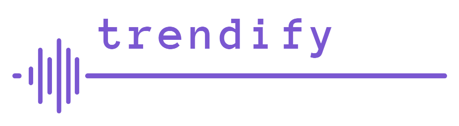

<!-- Improved compatibility of back to top link: See: https://github.com/othneildrew/Best-README-Template/pull/73 -->
<a name="readme-top"></a>
<!--
*** Thanks for checking out the Best-README-Template. If you have a suggestion
*** that would make this better, please fork the repo and create a pull request
*** or simply open an issue with the tag "enhancement".
*** Don't forget to give the project a star!
*** Thanks again! Now go create something AMAZING! :D
-->


<!-- PROJECT SHIELDS -->
<!--
*** I'm using markdown "reference style" links for readability.
*** Reference links are enclosed in brackets [ ] instead of parentheses ( ).
*** See the bottom of this document for the declaration of the reference variables
*** for contributors-url, forks-url, etc. This is an optional, concise syntax you may use.
*** https://www.markdownguide.org/basic-syntax/#reference-style-links
-->
[![Contributors][contributors-shield]][contributors-url]
[![Forks][forks-shield]][forks-url]
[![Stargazers][stars-shield]][stars-url]
[![Issues][issues-shield]][issues-url]
[![MIT License][license-shield]][license-url]
[![LinkedIn][linkedin-shield]][linkedin-url]


<!-- PROJECT LOGO -->
<br />
<div align="center">
  <a href="https://github.com/rafmosch/trendify">
    
  </a>

<h3 align="center">Trendify</h3>

  <p align="center">
    A tool used in tracking the public sentiment of a concept over time, by analyzing relevant tweets.
    <!-- <br />
    <a href="https://github.com/rafmosch/trendify"><strong>Explore the docs »</strong></a>
    <br /> -->
    <br />
    <a href="https://github.com/rafmosch/trendify">View Demo</a>
    ·
    <a href="https://github.com/rafmosch/trendify/issues">Report Bug</a>
    ·
    <a href="https://github.com/rafmosch/trendify/issues">Request Feature</a>
  </p>
</div>


<!-- TABLE OF CONTENTS -->
<details>
  <summary>Table of Contents</summary>
  <ol>
    <li>
      <a href="#about-the-project">About The Project</a>
      <ul>
        <li><a href="#built-with">Built With</a></li>
      </ul>
    </li>
    <li>
      <a href="#getting-started">Getting Started</a>
      <ul>
        <li><a href="#prerequisites">Prerequisites</a></li>
        <li><a href="#installation">Installation</a></li>
      </ul>
    </li>
    <li><a href="#usage">Usage</a></li>
    <li><a href="#roadmap">Roadmap</a></li>
    <li><a href="#contributing">Contributing</a></li>
    <li><a href="#license">License</a></li>
    <li><a href="#contact">Contact</a></li>
    <li><a href="#acknowledgments">Acknowledgments</a></li>
  </ol>
</details>


<!-- ABOUT THE PROJECT -->
## About The Project

<!-- [![Product Name Screen Shot][product-screenshot]](https://example.com) -->

Twitter is a platform where anyone can publicly and succinctly state their personal, honest opinion regarding a trend, idea, or concept. Hence, the retrieval of numerous tweets regarding a specific concept can be used to sentimentally analyze them and provide a positivity/negativity score. Taking into consideration tweets posted over a certain period of time, the variation of public attitude with regards to this concept can be visualized.

Furthermore, other relevant features include the ability to see where in the world the given idea is being stated the most in tweets, who are the most popular Tweeter users talking about this idea right now, and what other keywords/ideas are often correlated to the given one.

<p align="right">(<a href="#readme-top">back to top</a>)</p>


### Built With
* [![Python][Python-badge]][Python-url]
* [![Flask][Flask-badge]][Flask-url]
* [![React][React-badge]][React-url]
* [![scikit-learn][scikit-learn-badge]][scikit-learn-url]
* [![NLTK][NLTK-badge]][NLTK-url]
* [![pandas][pandas-badge]][pandas-url]
* [![Tweepy][tweepy-badge]][tweepy-url]


<p align="right">(<a href="#readme-top">back to top</a>)</p>


<!-- GETTING STARTED -->
## Getting Started

This is an example of how you may give instructions on setting up your project locally.
To get a local copy up and running follow these simple example steps.

### Prerequisites

This is an example of how to list things you need to use the software and how to install them.
* Prereq 1
  ```sh
  npm install npm@latest -g
  ```

### Installation

1. Step 1

<p align="right">(<a href="#readme-top">back to top</a>)</p>

<!-- USAGE EXAMPLES -->
## Usage

* Political opinion tracking: This tool can be used in monitoring people's attitude towards political matters over time, correlating any deviations to real-world events that may have taken place.
* Marketing choices: Businesses can see first-hand results of recent or historical marketing choices (i.e., the release of a new product), and how those affected the reputation of the brand.
* Geographical reach: It is possible to see where in the world are most tweets being posted containing certain keywords, effectively identifying one's audience geographically.
* Trend tracking: Ability to see how the relevance of a trend/idea varies over time, leading to informed investment decisions.


<!--_For more examples, please refer to the [Documentation](https://example.com)_-->

<p align="right">(<a href="#readme-top">back to top</a>)</p>


<!-- ROADMAP -->
## Roadmap

- [ ] Tweet mining
    - [ ] Retrieve tweets based on keywords
    - [ ] Retrieve tweets posted between certain dates
    - [ ] Retrieve tweets posted by users from certain geographical areas
    - [ ] Find popular users posting tweets with said keywords
    - [ ] Identify other relevant keywords
    - [ ] Group tweets by their post date (each group receives sentiment score)
- [ ] Sentiment analysis
    - [ ] Find and clean up appropriate dataset
    - [x] Preprocessing (lowercase, lemmatization, remove punctuation, etc.)
    - [ ] Choice of classifier model (i.e., logistic regression, random forest) and training
    - [ ] Hyperparameter tweaking - grid search
    - [ ] Processing and scoring of retrieved tweets
- [ ] Presentation
    - [ ] Create backend with Flask
    - [ ] Create frontend with React in Material UI style
        - [ ] Graph of sentiment score against time (maybe add 'download to csv' option)
        - [ ] Graph of amount of relevant tweets posted against time (to see how trends rise and fall)
        - [ ] Calendar widget to enter dates
        - [ ] Map widget to show areas from which posts originate the most (i.e., top 5 countries)
        - [ ] Show relevant keywords in world cloud style
- [ ] Release
    - [ ] Acquire hosting server & domain
    - [ ] Promotion

See the [open issues](https://github.com/rafmosch/trendify/issues) for a full list of proposed features (and known issues).

<p align="right">(<a href="#readme-top">back to top</a>)</p>


<!-- CONTRIBUTING -->
## Contributing

Contributions are what make the open source community such an amazing place to learn, inspire, and create. Any contributions you make are **greatly appreciated**.

If you have a suggestion that would make this better, please fork the repo and create a pull request. You can also simply open an issue with the tag "enhancement".
Don't forget to give the project a star! Thanks again!

1. Fork the Project
2. Create your Feature Branch (`git checkout -b feature/AmazingFeature`)
3. Commit your Changes (`git commit -m 'Add some AmazingFeature'`)
4. Push to the Branch (`git push origin feature/AmazingFeature`)
5. Open a Pull Request

<p align="right">(<a href="#readme-top">back to top</a>)</p>


<!-- LICENSE -->
## License

Distributed under the MIT License. See `LICENSE.txt` for more information.

<p align="right">(<a href="#readme-top">back to top</a>)</p>


<!-- CONTACT -->
## Contact

Your Name - [@raf_mos](https://twitter.com/raf_mos) - raf.mos@princeton.edu

Project Link: [https://github.com/rafmosch/trendify](https://github.com/rafmosch/trendify)

<p align="right">(<a href="#readme-top">back to top</a>)</p>


<!-- ACKNOWLEDGMENTS -->
## Acknowledgments

* []()
* []()
* []()

<p align="right">(<a href="#readme-top">back to top</a>)</p>


<!-- MARKDOWN LINKS & IMAGES -->
<!-- https://www.markdownguide.org/basic-syntax/#reference-style-links -->
[contributors-shield]: https://img.shields.io/github/contributors/rafmosch/trendify.svg?style=for-the-badge
[contributors-url]: https://github.com/rafmosch/trendify/graphs/contributors
[forks-shield]: https://img.shields.io/github/forks/rafmosch/trendify.svg?style=for-the-badge
[forks-url]: https://github.com/rafmosch/trendify/network/members
[stars-shield]: https://img.shields.io/github/stars/rafmosch/trendify.svg?style=for-the-badge
[stars-url]: https://github.com/rafmosch/trendify/stargazers
[issues-shield]: https://img.shields.io/github/issues/rafmosch/trendify.svg?style=for-the-badge
[issues-url]: https://github.com/rafmosch/trendify/issues
[license-shield]: https://img.shields.io/github/license/rafmosch/trendify.svg?style=for-the-badge
[license-url]: https://github.com/rafmosch/trendify/blob/master/LICENSE.txt
[linkedin-shield]: https://img.shields.io/badge/-LinkedIn-black.svg?style=for-the-badge&logo=linkedin&colorB=555
[linkedin-url]: https://www.linkedin.com/in/rafael-moschopoulos-50161b281/
[product-screenshot]: images/screenshot.png

[Python-badge]: https://img.shields.io/badge/Python-4584b6?style=for-the-badge&logo=python&logoColor=ffde57
[Python-url]: https://www.python.org/

[Flask-badge]: https://img.shields.io/badge/flask-FFFFFF?style=for-the-badge&logo=flask&logoColor=black
[Flask-url]: https://flask.palletsprojects.com/en/2.3.x/

[React-badge]: https://img.shields.io/badge/React-20232A?style=for-the-badge&logo=react&logoColor=61DAFB
[React-url]: https://reactjs.org/

[scikit-learn-badge]: https://img.shields.io/badge/scikit%20learn-f89a36?style=for-the-badge&logo=scikit-learn&logoColor=319ace
[scikit-learn-url]: https://scikit-learn.org/

[NLTK-badge]: https://img.shields.io/badge/NLTK-ffffff?style=for-the-badge&logo=python&logoColor=154f5b
[NLTK-url]: https://www.nltk.org/

[pandas-badge]: https://img.shields.io/badge/pandas-130654?style=for-the-badge&logo=pandas&logoColor=ffffff
[pandas-url]: https://pandas.pydata.org/

[tweepy-badge]: https://img.shields.io/badge/Tweepy-5ea9de?style=for-the-badge&logo=twitter&logoColor=ffffff
[tweepy-url]: https://www.tweepy.org/


